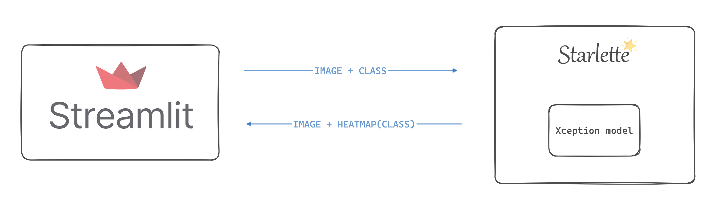

> **Note:** This is a project for learning purposes only. The concepts applied here are not necessarily proposed for a production environment.

Grad-CAM APP is a project for demonstrate how to use [streamlit](https://streamlit.io/) and [starlette](https://www.starlette.io/) 
in an application that explain image classifications using heatmaps.



## How run the app 🚀

1. ```docker compose up```

2. Take a cup of coffee ☕️

3. [```localhost:8501```](http://localhost:8501) 🔗


## Grad CAM

Grad-CAM is an Explainable AI technique that can be used in 
any convolutional neural network regardless of its architecture. 

I wrote a post explaining how this technique works, you can find it on [my medium page](https://medium.com/@arthurfmorais).

The implementation of this application was inspired by a [keras tutorial](https://keras.io/examples/vision/grad_cam/).
